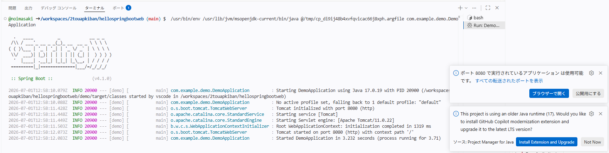

# 2統括AP基盤お勉強用

## 環境構築（codespace）

リポジトリ内で`.devcontainer/devcontainer.json`を作成し、以下を記述する。

```json
{
  "name": "Java 17 + Maven",
  "image": "mcr.microsoft.com/devcontainers/java:17-bookworm",

  "features": {
    "ghcr.io/devcontainers/features/java:1": {
      "version": "none",
      "installMaven": true,
      "installGradle": false
    }
  },

  "customizations": {
    "vscode": {
      "extensions": [
        "vscjava.vscode-java-pack"
      ]
    }
  },

  "postCreateCommand": "java -version && mvn -version"
}
```

あとは、codespaceを新しくcreateするだけ。

動作確認は以下の通り。

```bash
java -version
mvn -version
```

## 環境構築（postgresql）
codespace内にDocekrを入れて、postgresqlコンテナを立てる（Docker in Docker）

devcontainer.jsonのfeaturesに追加することで、（Javaの時と同様に）Dockerも開発コンテナをリビルドすると含めてくれる様になる。

すでに作成した、`.devcontainer/devcontainer.json`に以下の記述を追加して、開発コンテナにDockerを入れる。

```json
"features": {
    "ghcr.io/devcontainers/features/java:1": {
      "version": "none",
      "installMaven": true,
      "installGradle": false
    },
    "ghcr.io/devcontainers/features/docker-in-docker:2": {} // 追加箇所
  },
```

追加後、codespacesをリビルドして、以下コマンドでDockerが入ったことを確認する。

```bash
docker info
docker compose version
java -version // 念の為、javaが消えてないか確認
```


## Hello Worldしてみる
1. `helloworld/Hello.java`を作成
2. `helloworld`ディレクトリで、コンパイルする

```bash
javac Hello.java
```

3. 実行
```bash
java Hello
```

## SpringBootでHello Worldしてみる
1. VScodeの拡張機能の`SpringInitializer`をCodespaceに追加し、SpringBootプロジェクトを作成（`./hellospringbootweb`）
2. Controllerとhtmlテンプレートを作成して、起動クラスを実行する。
3. 無事に起動すると、ポート転送されるので、ボタン押下すれば、ブラウザからCodespace上で実行されたAPサーバにアクセスできる。


